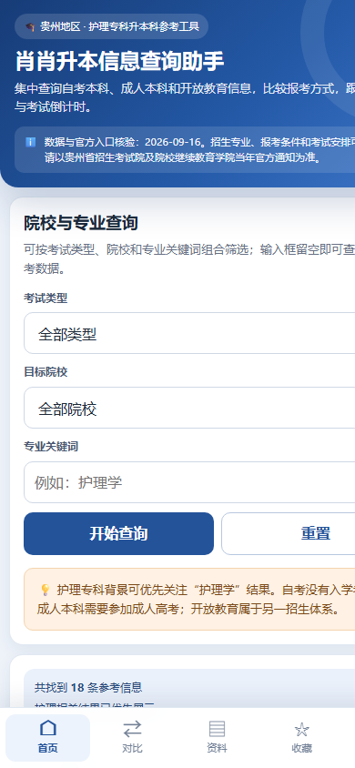

<div align="center">


# 肖肖升本信息查询助手

面向贵州护理专科升本科的移动端信息查询工具

[在线使用](https://tangying2002.github.io/xiaoxiao-shengben/) · [问题反馈](https://github.com/tangying2002/xiaoxiao-shengben/issues)

</div>



## 项目简介

“肖肖升本信息查询助手”是一个可直接在手机浏览器中使用的静态网页 App，重点服务护理专科毕业生了解贵州地区自考本科、成人本科和开放教育本科的招生信息。

项目无需安装，支持苹果和安卓手机。通过 Safari 或 Chrome 的“添加到主屏幕”，可以像普通 App 一样打开，并在首次访问后离线使用。

> 本项目的院校、专业、考试和就业信息仅用于报考规划参考，不替代贵州省招生考试院及各高校发布的正式文件。

## 主要功能

- **院校与专业查询**：按考试类型、院校和专业关键词筛选招生信息。
- **官方招生入口**：每条院校信息提供对应的成考、自考或开放教育官方栏目入口。
- **院校对比**：最多选择 4 条信息，对比费用、学制、入学方式、学习方式、教学管理和考试安排。
- **专业资料**：查看专业介绍、主要课程、就业方向和考试复习重点。
- **就业信息来源**：链接到高校官方就业信息网或毕业生就业质量报告入口。
- **收藏管理**：收藏重点院校和专业，数据保存在当前设备浏览器中。
- **材料清单**：按照报考阶段准备身份证、学历、护理执业和学位申请材料。
- **考试倒计时**：查看参考考试日期，并可根据官方公告自行修改。
- **移动端体验**：底部导航、触控优化、安全区适配和离线缓存。

## 手机使用

### 在线访问

使用苹果 Safari 或安卓 Chrome 打开：

**https://tangying2002.github.io/xiaoxiao-shengben/**

### 添加到苹果主屏幕

1. 使用 Safari 打开公开链接。
2. 点击底部的“分享”按钮。
3. 选择“添加到主屏幕”。
4. 桌面会出现“肖肖升本”图标，点击即可使用。

### 离线使用

首次打开后，页面会自动缓存。后续即使网络较慢，也可以直接打开已缓存版本。招生数据更新后，重新连接网络并刷新页面即可获取新版本。

## 收录内容

当前版本包含：

- 贵州地区 18 条院校与招生类型参考信息
- 15 类专业介绍、课程和就业方向资料
- 成考、自考、开放教育官方招生入口
- 官方考试大纲和就业报告入口
- 院校横向对比、收藏、材料清单和考试倒计时

不同高校公布信息的时间和详细程度不一致。未公开或无法核验的具体数据会明确标注“以学校官方说明为准”，项目中不会编造录取分数、就业率或内部考试重点。

## 数据来源原则

- 贵州省招生考试院官方公告
- 各高校继续教育学院、招生信息网和官方招生简章
- 高校官方专业介绍和毕业生就业质量报告
- 学信网公开学历查询规则

第三方网站仅用于发现候选院校和专业，最终数据以官方来源为准。

## 隐私说明

- 不收集个人身份信息。
- 不上传姓名、学历、执业证书或其他个人材料。
- 收藏、对比、材料勾选和考试日期仅保存在使用者自己的浏览器中。
- 清除浏览器数据会同时清除本地保存的收藏和设置。

## 技术实现

- HTML、CSS 和原生 JavaScript
- PWA Web App Manifest
- Service Worker 离线缓存
- GitHub Pages 静态托管
- 无后端、无数据库、无第三方追踪脚本

## 项目结构

```text
.
├── index.html                  # 完整应用页面
├── manifest.webmanifest        # PWA 应用信息
├── service-worker.js           # 离线缓存
├── pwa-mobile.js               # 苹果主屏幕提示
├── preview.png                 # 手机端预览图
├── icons/
│   ├── apple-touch-icon.png
│   ├── icon-192.png
│   └── icon-512.png
└── README.md
```

## 免责声明

本项目为个人学习与信息整理工具，与任何高校、教育考试机构或招生单位无隶属关系。招生政策、专业目录、学费、考试安排及就业信息可能调整，正式报名和缴费前请务必查阅贵州省招生考试院及目标院校当年发布的官方公告。